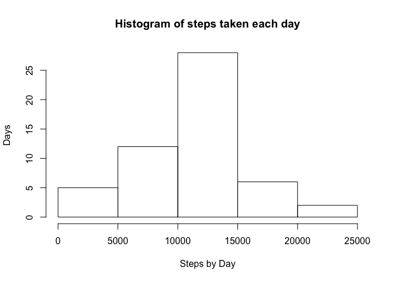
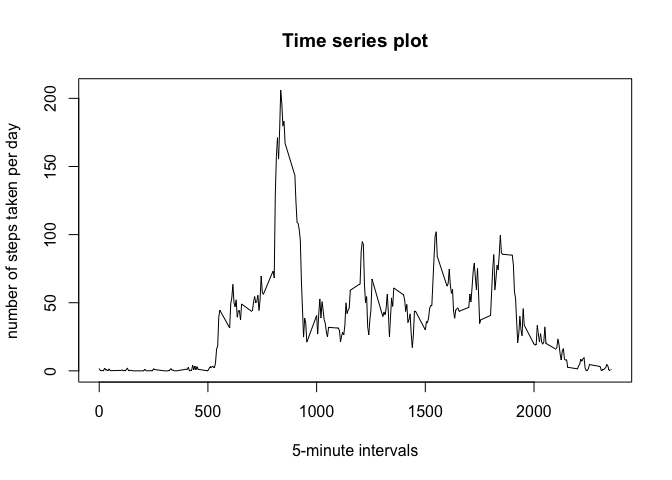
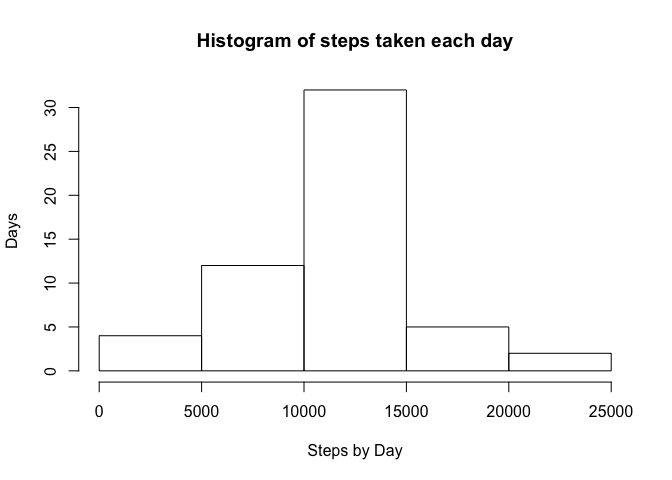
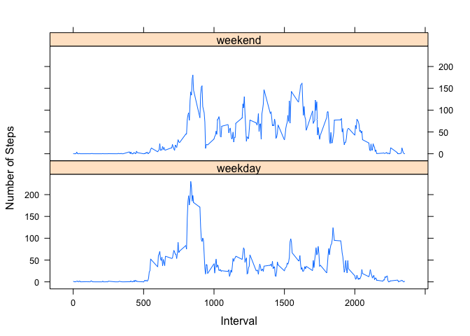

## Loading and preprocessing the data

```r
data_set <- read.csv("activity.csv")
```


## What is mean total number of steps taken per day?

1.- Calculate the total number of steps taken per day

```r
steps_day <-aggregate(steps~date, data = data_set, sum, na.rm = TRUE)
```

2.- Make a histogram of the total number of steps taken each day

```r
hist(steps_day$steps, xlab = "Steps by Day", ylab= "Days", 
     main = "Histogram of steps taken each day")
```

<!-- -->

3.-Calculate and report the mean and median of the total number of steps taken per day

The mean is:

```r
mean(steps_day$steps)
```

```
## [1] 10766.19
```

The median is:


```r
median(steps_day$steps)
```

```
## [1] 10765
```

## What is the average daily activity pattern?

1.- Time series plot of the 5-minute interval and the average number of steps taken.

```r
intervals <- aggregate(steps~interval, data = data_set, mean, na.rm = TRUE)

plot(intervals$interval, intervals$steps, type = "l", xlab = "5-minute intervals", 
     ylab = "number of steps taken per day", main = "Time series plot")
```

<!-- -->

2.- Which 5-minute interval, on average across all the days in the dataset, contains the maximum number of steps?

```r
which.max(intervals$steps)
```

```
## [1] 104
```

## Imputing missing values

1.- Calculate and report the total number of missing values in the dataset.

```r
length(data_set$steps[is.na(data_set$steps)])
```

```
## [1] 2304
```

2.- I will use the mean of the intervals for replacing the data in a new data_set_2

```r
indices <- which(is.na(data_set$steps))
data_set_2 <- data_set
replace_vect <-vector()

for (i in 1:length(indices)) {
  data_set_2$steps[i] <- intervals$steps[match(data_set$interval[i]
                                              , intervals$interval)]
}
```


3.- Make a histogram of the total number of steps taken each day 


```r
steps_day <-aggregate(steps~date, data = data_set_2, sum, na.rm = TRUE)

hist(steps_day$steps, xlab = "Steps by Day", ylab= "Days", 
     main = "Histogram of steps taken each day")
```

<!-- -->

Calculating the mean for the new data


```r
mean(steps_day$steps)
```

```
## [1] 10789.35
```

Calculating the median for the new data


```r
median(steps_day$steps)
```

```
## [1] 10766.19
```

The mean is 20 steps more approximately, and the median increases in 1 step, this is not a great change in the total daily number of steps.

## Are there differences in activity patterns between weekdays and weekends?

1.- Create a new factor variable in the dataset with two levels – “weekday” and “weekend” indicating whether a given date is a weekday or weekend day.

```r
library(dplyr)
```

```
## 
## Attaching package: 'dplyr'
```

```
## The following objects are masked from 'package:stats':
## 
##     filter, lag
```

```
## The following objects are masked from 'package:base':
## 
##     intersect, setdiff, setequal, union
```

```r
data_set_2 <- mutate(data_set_2, type = weekdays(as.Date(date)))

for(i in 1:length(data_set_2$type)){
  if (data_set_2$type[i] == "Sunday" | data_set_2$type[i] == "Saturday"){
    data_set_2$type[i] <- "weekend"
  }
  else{
    data_set_2$type[i] <- "weekday"
  }
}
```


2.-panel plot containing a time series plot

```r
stepsperday <- aggregate(steps ~ interval + type, data = data_set_2, mean)

library(lattice)
xyplot(steps ~ interval | type, stepsperday, type = "l", layout = c(1,2), xlab="Interval", ylab="Number of Steps")
```

<!-- -->
